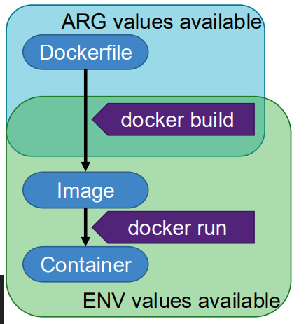

## Docker File Instructions

### FROM
> FROM [--platform=\<platform>] IMAGE [AS \<name>]
>
> FROM ubuntu:22.04

* intialises a new build image
* sets Base Image for subsequent instructions

### RUN
Two forms   
1. Shell Commands
> RUN \<command>
> 
> RUN apt-get update

2. Exec form
> RUN ["executable", "param1", "param2"]
>
> RUN ["/bin/bash", "-c", "echo hello"]

* parsed as a jason array - must use double quotes

### COPY
Similar to RUN - two forms

> COPY [--chown=\<user>:\<group>] \<src>... \<dest>
>
> COPY [--chown=\<user>:\<group>] ["\<src>",... "\<dest>"]
>
> COPY website/*.html /var/www/html

* Option "chown" to change user/group info in dest folder

### ADD
Similar to COPY but more powerful
> ADD [--chown=\<user>:\<group>] \<src>... \<dest>
>
> ADD [--chown=\<user>:\<group>] ["\<src>",... "\<dest>"]

* if src is a remote file, ADD can download it to dest folder and set permissions
* if src is compressed, ADD can download & uncompress 
* COPY preferred than ADD

### EXPOSE
> EXPOSE PORT [PORT/PROTOCOL...]
>
> EXPOSE 80/tcp

* informs docker that the container listens on the specified ports at runtime
* can specify potocol (default tcp if protocol not specified)
* EXPOSE 80 declares container will use PORT 80 but does not actually open the port
* ^ done at runtime

### CMD
> CMD ["executable","param1","param2"]

* provides defaults for an executing container
* only one CMD intruction in a dockerfile

### ENTRYPOINT

### ENV
> ENV \<key> \<value>
>
> ENV myName Nawal  
> ENV mySchool UQ

* sets env variable \<key> to value \<value>
* this value will be in env for all subsequent instructions in build stage

### ARG
> ARG \<name>[=\<default value>]

* defines variable users can pass at build-time to with the docker build command
* ^ using --build-arg flag

### ENV VS ARG
Both used to define variables  
Lifecycles are different
* ARG - define during build time
* ENV - during running container

ARG values can be changed when building
* --build-arg can overwrite values
ENV cannot be directly changed when building

### WORKDIR
> WORKDIR /path/to/workdir

* sets working dir
* if it doesn't exist, will be created